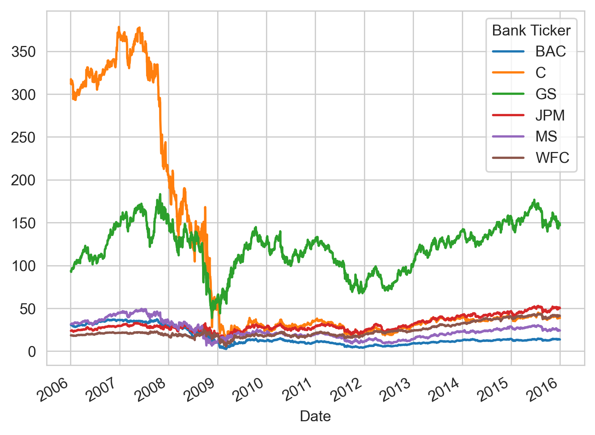
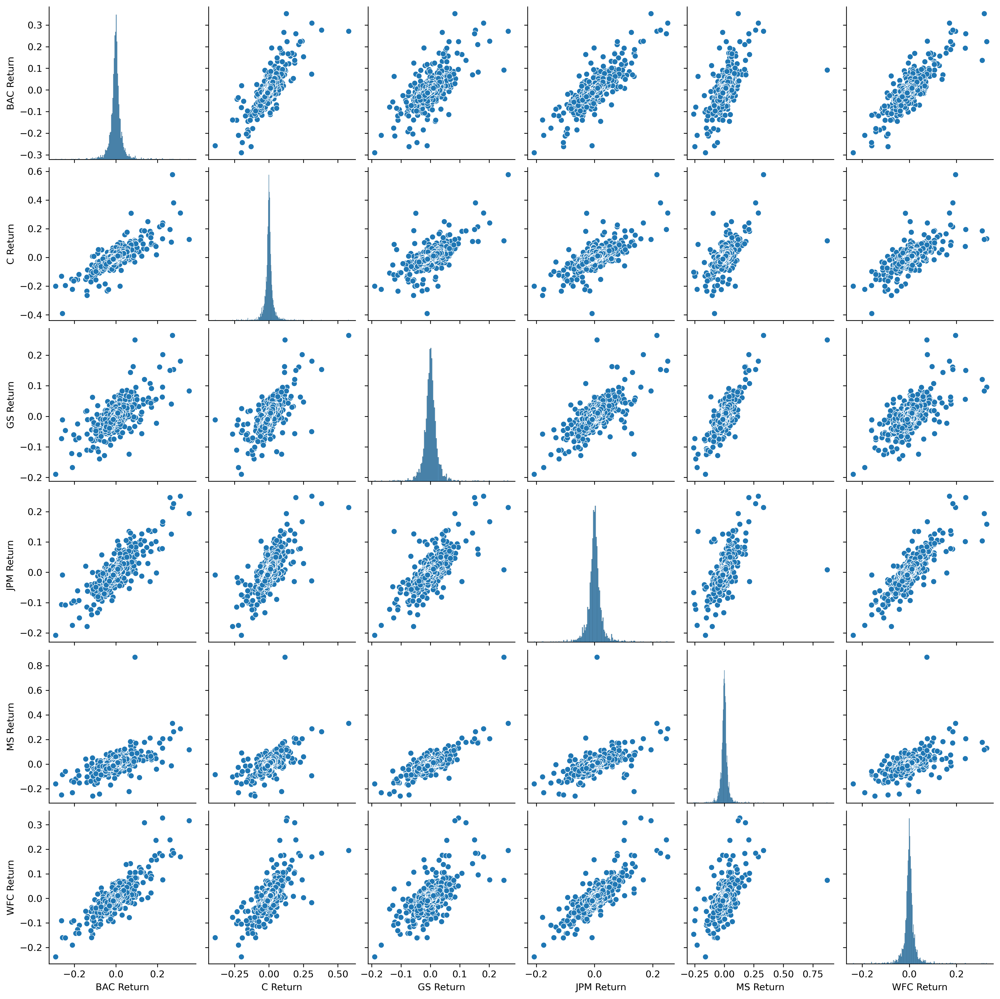
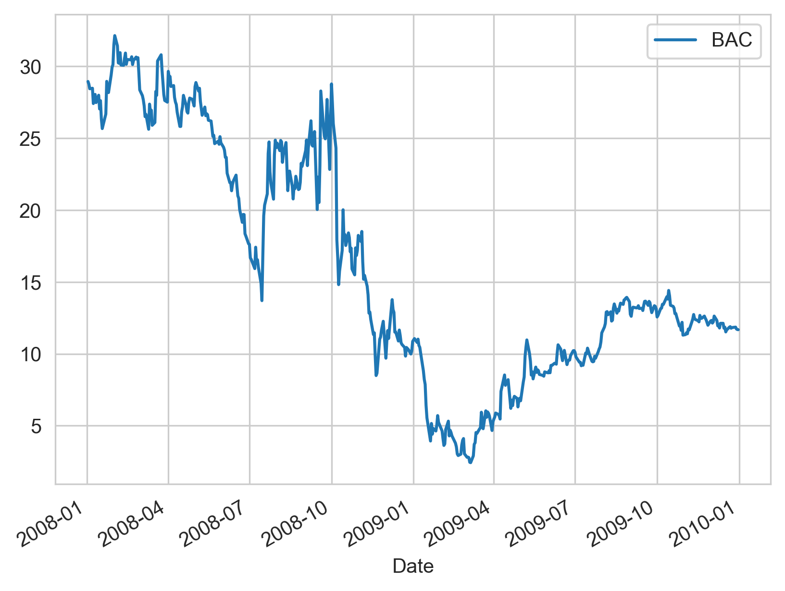
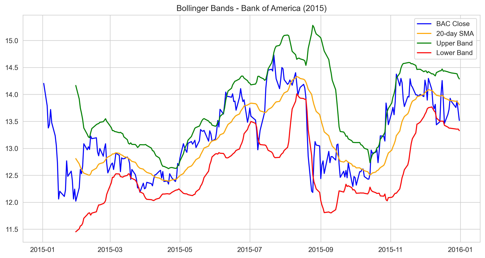
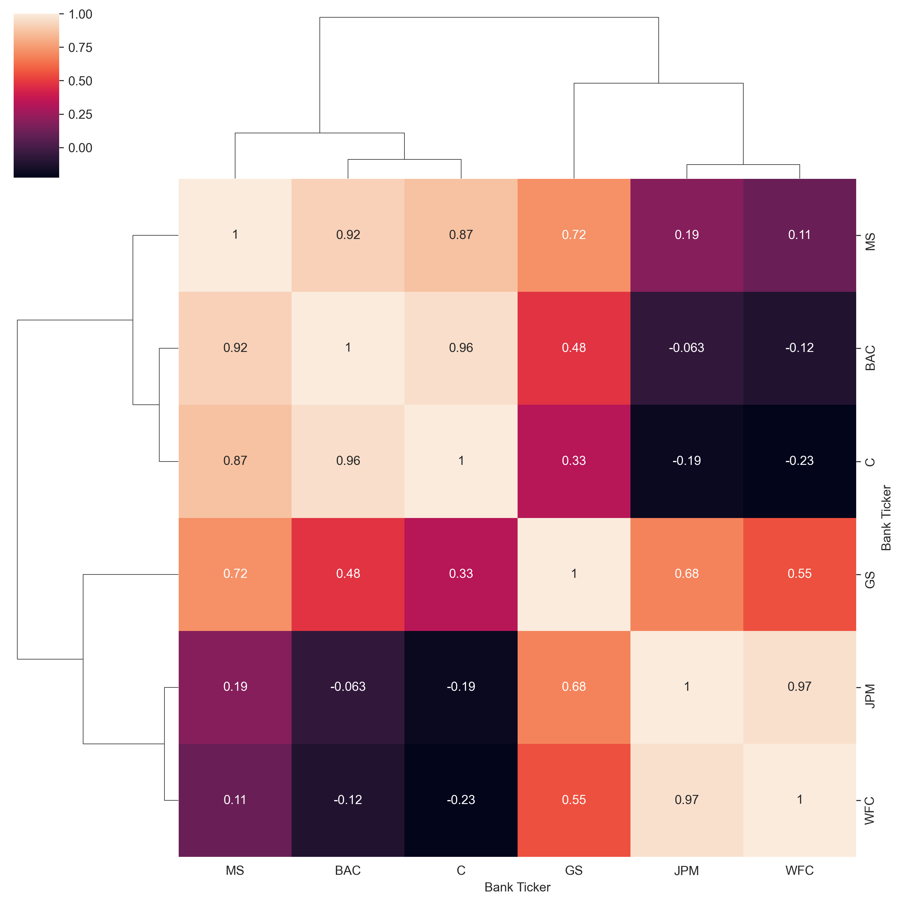

# **Financial Time-Series Analysis: The 2008 Banking Crisis**
*A quantitative study of major U.S. bank stocks (BAC, JPM, GS, MS, C, WFC) to analyze market volatility, risk profiles, and technical indicators during the Great Recession.*

---

## **Project Overview**
This project explores 10 years of historical stock data (2006–2016) to audit the behavior of the "Big Six" banks. 

---

## **Financial EDA & Market Insights**
Before modeling, I performed deep-dive analytics to identify structural trends in equity behavior.

### **1. Long-Term Sector Trends**

Visualized the 10-year trajectory of Closing prices for all six banks to observe the crash and subsequent recovery cycles[cite: 350, 723].

### **2. Volatility & Return Analysis**

Generated a pairplot of daily percentage returns to analyze the "tightness" of sector movement and identify high-risk outliers[cite: 419].

---

## **Technical Analysis: Bank of America (BAC)**
I focused a technical audit specifically on **Bank of America** to demonstrate how professional indicators react to market volatility.

### **3. 30-Day Moving Average**

Applied a 30-day rolling window to BAC's 2008 price action to visualize the smoothing of high-volatility trends during the crash[cite: 819].

### **4. Volatility Strategy: Bollinger Bands**

Implemented Bollinger Bands for BAC (2015) to analyze price action relative to its 20-day standard deviation, showcasing an understanding of mean reversion and statistical ranges[cite: 1061, 1068].

---

## **5. Sector Correlation & Clustering**

Applied hierarchical clustering to correlation matrices of stock prices. This revealed the mathematical proximity of specific banks during market stress, demonstrating a "sector-wide" contagion effect[cite: 953].

---

## **Key Takeaways**
* **Scientific Rigor:** Identified Jan 20, 2009 (Inauguration Day) as a shared "worst-return" day, proving how macro-events drive market sentiment.
* **Risk Categorization:** Calculated standard deviations to classify the "riskiest" stocks (Citigroup/Morgan Stanley) relative to the sector[cite: 568, 570].
* **Data Integrity:** Sourced data programmatically via `yfinance` and handled complex MultiIndex DataFrames[cite: 226, 347].

---

## **How to Run**
```bash
pip install pandas_datareader yfinance
jupyter notebook "04-Finance Project.ipynb"
